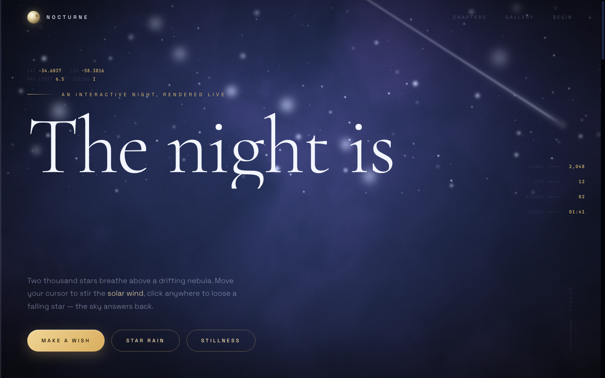

# NOCTURNE

**A living night sky, rendered entirely in your browser.** No images, no libraries — one HTML file with a real-time WebGL nebula, 2,000 twinkling stars, shooting stars, and a sky that answers back when you click it.

## See it live

> **https://stavitian.github.io/nocturne/**

(Or just download `index.html` and double-click it — everything runs locally.)

## What's inside

- **Procedural nebula** — layered fractal Brownian motion (FBM) noise in a GLSL fragment shader
- **2,000+ stars** across three parallax depth fields, each with its own twinkle phase and magnitude
- **Shooting stars** — periodic meteors plus on-demand bursts
- **Pointer solar wind** — the camera sways toward your cursor and a soft aurora follows it
- **Interactive wishes** — click the sky to send a ripple; the HUD keeps count
- **Gallery of skies** — four tiles, each running its own shader preset (Rose Nebula, Cold Sea, Ember Drift, Violet Hour)
- **Scroll cinematography** — the camera pushes in as you descend toward the finale

## Controls

| Action | Result |
|---|---|
| Move the cursor | Sways the camera, stirs the aurora |
| Click the sky | Ripple + wish logged (watch the HUD) |
| `Make a wish` | A wish appears somewhere in the dark |
| `Star rain` | Meteor shower for ~3 seconds |
| `Stillness` | The sky holds its breath |
| Footer links | Fullscreen · pause motion |

## Notes

- Respects `prefers-reduced-motion` (the sky crawls instead of dancing)
- Responsive down to mobile; HUD hides below 1100px
- Zero dependencies — Google Fonts is the only external request
- Tested in Chrome 150: zero console errors

---

*Rendered live in your browser. No images were harmed.*
